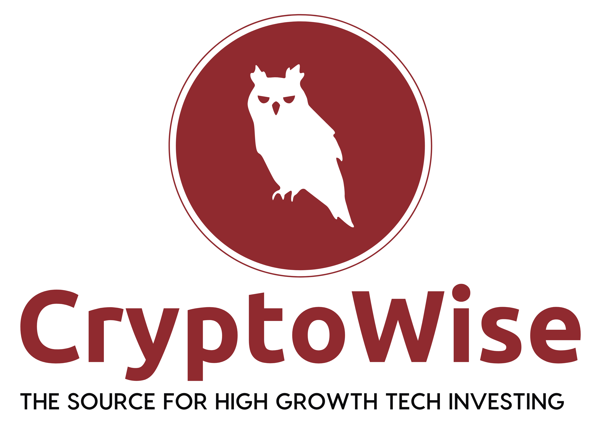

# CryptoWise
> An ecosystem for quantamental traders and investors

This is the ecosystem MonoRepo with Elixir Backend, React Frontend, and GitOps. Envoy Proxy, Kubernetes in progress.

The website is end-to-end encrypted and lives on Google Cloud Platform in docker optimized containers:

[](https://www.cryptowise.ai/signup)

<!-- Watch this Project:

[](https://github.com/upstarter/cryptowise/subscription)
 -->

We are looking for contributors! If you interested in learning the latest technologies, join us in building
a distributed and decentralized autonomous system for capturing value from global financial markets.

Fork It:
[fork](https://github.com/upstarter/cryptowise/fork)

Watch/ Follow:
[watch](https://github.com/upstarter/cryptowise/subscription)

Create Issues:
[create issue](https://github.com/upstarter/cryptowise/issues/new)

## We are using the following technologies for the core system (with explanations why):

### Backend
- [Elixir & OTP](www.elixir-lang.org) - the functional distributed systems and concurrency platform for massive scale and modern web services.

### Frontend
- [React](www.reactjs.org) - Simple and modular web document technology
- [Webpack](www.webpack.js.org) - Control over all aspects of the frontend
- [Sass](www.sass-lang.com) - CSS improved
- [CSS Grid](https://developer.mozilla.org/en-US/docs/Web/CSS/CSS_Grid_Layout) - responsive layouts made easy
- [Ant Design](www.ant.design) - Ideal framework for mobile and web quant heavy designs (build by ant financial)

### Gitops
- [Docker Compose](www.docker.com) - bootstrapped microservices
- [Envoy](www.envoyproxy.io) - the sidecar web proxy for modern microservice architectures (nginx on steroids with builtin TLS, GRPC, circuit breakers, etc..)
- [Terraform](www.terraform.io) - infrastructure as code for gitops
- [Istio](www.istio.io) - connect, control, secure, and observe services
- [Kubernetes](www.kubernetes.io) - the infrastructure orchestration tool dejour
- [Helm](www.helm.sh) - Power tools for Kubernetes
 <!--  -->


If you are interested in learning the latest WealthTech algorithms and adding skills like new development tools (elixir, microservices, react, and gitops), contributing to this project would be a good opportunity for you to pick them up.

## To update all submodules at once
`git pull --recurse-submodules`

## To update frontend and backend submodules seperately
```
git submodule update --init cryptowise_frontend
git submodule update --init platform_umbrella
```

Building and Running the system:
To build and run the frontend standalone, cd into cryptowise_frontend and run:
```
yarn build
yarn start
```
This runs webpack-dev-server on localhost:8081 for local development.

To run the whole system in the docker environment:
```
docker-compose up --build
```
